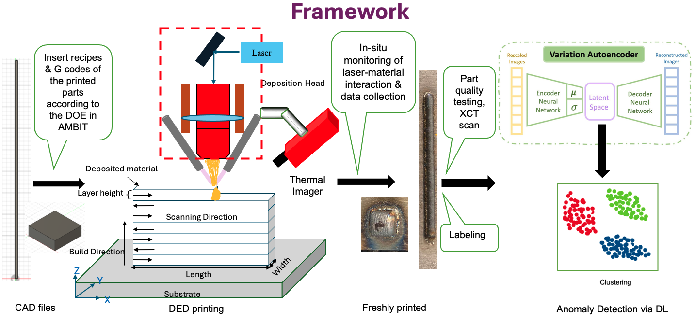

# Anomaly_detection_
Variational Autoencoder, Unsupervised Clustering

Melting pool dynamics during 3D metal printing processes, such as Directed Energy Deposition and Powder Bed Fusion, are directly correlated with internal defects like pores and cracks. However, visually detecting anomalies in melt pool images is challenging, and obtaining labeled data from post-processing techniques like X-ray computed tomography is expensive, making unsupervised anomaly detection crucial for melt pool analysis. In this project, I applied unsupervised clustering models, including K-means and Gaussian Mixture Model, on the latent space of a Variational Autoencoder (VAE), achieving 95% accuracy for real-time anomaly detection in thermal image datasets.

